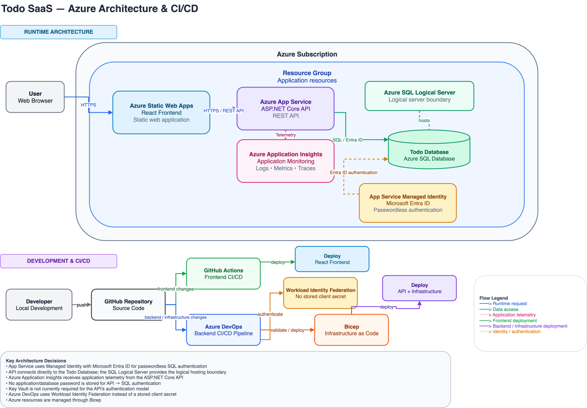

# Todo SaaS Azure

This project is a Todo SaaS application built around a modern Azure-based architecture, with a React frontend, ASP.NET Core backend API, and Azure SQL Database. This was built to learn Azure cloud architecture.

## Original Goals

- Build a full-stack application
- Deploy using Azure services
- Learn Azure administration concepts
- Practice AZ-104 certification objectives
- Implement cloud best practices incrementally

## Architecture

- React frontend hosted on Azure Static Web Apps
- ASP.NET Core REST API hosted on Azure App Service
- Azure SQL Database for persistent data
- Azure Application Insights for application monitoring and telemetry
- Microsoft Entra ID / Managed Identity for passwordless API-to-database authentication
- Bicep for Infrastructure as Code
- GitHub for source control
- GitHub Actions for frontend CI/CD
- Azure DevOps for backend and infrastructure CI/CD
- Workload Identity Federation for secure CI/CD authentication without stored client secrets

# Future Directions
- Separate dev and production environments
- Azure VNets and Private Endpoints
- Redis for caching frequently accessed items  
- Blob storage for media uploads
- User accounts / authentication
- Email notification when item completed: necessitating event driven architecture (service bus / kafka)
- When requirements necessitate microservices, introduce containerization / orchestration. Possible future services: todo service, notification service, analytics